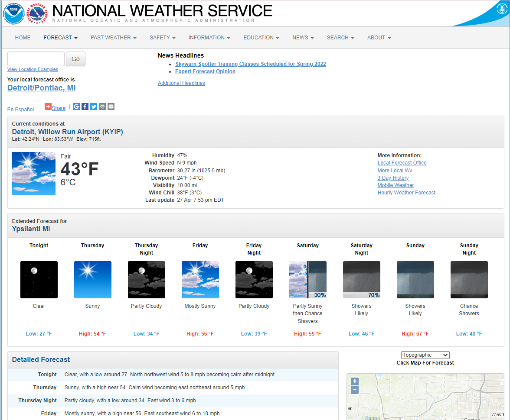

# MeredithsWebCrawler.github.io
The web crawler created for this lab collects data from the National Weather Service website. It scrapes data from Ypsilanti, Michigan's seven day forecast page. 



To carry out this process, one must first import the Requests library and use it to download the webpage. The BeautifulSoup Library also needs to be imported in order to correctly parse the html. 
```python
# Import Requests library 
import requests
# Download webpage using requests.get
page = requests.get("https://forecast.weather.gov/MapClick.php?lat=42.2408&lon=-83.6131#.YmF-q9PMKUk")
# Import BeautifulSoup library and create a class to parse the webpage
from bs4 import BeautifulSoup
soup = BeautifulSoup(page.content, 'html.parser')
```
The next step is to capture all the extended forecast items from the html. Following this, one is able to find all the time period names as well as the weather conditions summary, temperature, and conditions description used in the seven day forecast. 
```python
# Capture all the extended forecast items 
seven_day = soup.find(id="seven-day-forecast")
forecast_items = seven_day.find_all(class_="tombstone-container")

# Find all the time period names used in the seven day forecast
period_tags = seven_day.select(".tombstone-container .period-name")
periods = [pt.get_text() for pt in period_tags]
periods

# Find the weather conditions summary, temperature, and and conditions description for the various time periods in the seven day forecast
short_descs = [sd.get_text() for sd in seven_day.select(".tombstone-container .short-desc")]
temps = [t.get_text() for t in seven_day.select(".tombstone-container .temp")]
descs = [d["title"] for d in seven_day.select(".tombstone-container img")]
print(short_descs)
print(temps)
print(descs)
```
Now that all the necessary information has been acquired, the Pandas library can be imported and used to add the data to a Pandas DataFrame. 
```python
# Import Pandas library
import pandas as pd
#Add data to a Pandas DataFrame
weather = pd.DataFrame({
    "period": periods,
    "short_desc": short_descs,
    "temp": temps,
    "desc":descs
})
weather
```
Lastly, the DataFrame can be imported to your Google Drive and subsequantly downloaded and saved as a csv. 
```python
# Create data on to Google Drive
from google.colab import drive
# Mount your Drive to the Colab VM.
#drive._mount('/gdrive')
drive.mount('/gdrive')

# the file path where to store the output csv on google drive
output_file = '/gdrive/My Drive/weather.csv'

# Save the dataframe as a csv file
weather.to_csv(output_file, index=False)

from google.colab import files
files.download(output_file)
print("the csv has been downloaded to your local computer. The program has been completed successfully")
```
